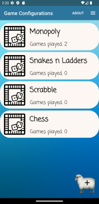
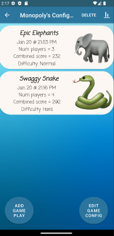
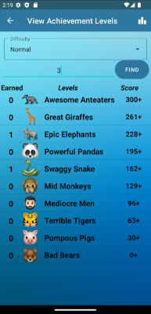

# Cooperative-Game-Converter

## Description
This project is an Android App written in Java using Android Studio which essentially allows for competitive board games to be played with a cooperative goal (i.e. eliminates competition and introduces teamwork). 
This is done by asking the user to calculate a number of points for each player during the game. Here are a few examples:
- Monopoly: x number of points for each square advancement.
- Chess: y number of points for each piece taken.
- Snakes & Ladders: z number of points for the z'th block that the player reaches

Given the user has a point calculation system, at the end of each of their board game, they can add a Game-Play (one full round of the board game) with each players points.
These points are then used to calculate the total points of all the players as a whole and given an achievement level (i.e. higher total points recieve a higher level and lower total points recieve a lower level).
The point is, users are encouraged to work together in pursuit of higher levels which ultimately leads to their board games to be played cooperatively, and the focus on who 'won' the game is less significant.

## Implementation
Logic:

Using OOP, I implemented 3 classes in Java:

- GamePlay: Represents a single round of any given board game. Contains attributes such as number of players, list of player scores, difficulty, level earned, time created, and memory image.
- GameConfig: Represents a single board game. Contains attributes such as a list of GamePlay objects, board game name, a low score, a high score, list of level names, and an image for the board game. This class is also responsible for calculating the scores for 10 levels using the low and high score.
- GameConfigManager: Represents a collection of GameConfigs. Contains attributes such as a list of GameConfigs and theme selection. Responsible for adding, removing, and editing GameConfigs.

UI:

The app consists of 7 different activities:

- MainActivity: The home page of the app where the list of board games resides. This is also where the theme is changed.
- ConfigActivity: This is where the list of rounds played of a board game resides. Each round is represented as an item in the list and displays important attributes such as the level name, time created, number of players, total points, and difficulty.
- GameActivity: This page is used to edit any attribute of a board game or a round of a board game, except the scores of players in a round. Has a form-like structure. 
- PlayerScoreActivity: This page is used to add, remove, or edit the scores of players for the chosen round.
- AchieveActivity: This page is where achievement levels can be viewed and their respective score as well as the number of times each has been earned.
- AchievementStatsActivity: This page contains a bar graph representing the number of times each level has been earned for a graphical representation.
- AboutActivity: This page contains information about the app such as a brief description, names of authors, and a reference list.

## Setup Requirements
- Install the latest version of Android Studio
- Install the latest version of the Software Development Kit
- Set up an emulator on Android Studio (API >= 27, any phone)
- Run the app (emulator must be API 27-33)

## How to Use

Adding a Board Game:

Firstly, the user is able to add and store board game(s) where they are prompted to enter the board game name, a score which is considered low (i.e. low score for a single player), and a score which is considered high (i.e. high score for a single player).
The low and high scores are used to create 10 different achievement levels (i.e. the highest level requires players to surpass the high score and vice versa, and the rest of the levels lie in between the low score and high score).
The user can also take and store an image of the board game which they are adding to the app, which will show beside the name of the board game in the list of board games.

Adding a Game-Play:

Inside of each board game is a list of Game-Plays for that specific board game (i.e. all the rounds played of the board game by the players). Each Game-Play is associated with an achievement level which the players achieved in that round.
When adding a Game-Play, one must input the number of players that played the round and their respective scores. The user must also select a difficulty level (easy, medium, or hard) which alters the scores needed to achieve all 10 levels
(easy means low threshold, medium means moderate threshold, and hard means a high threshold). Each Game-Play can also include an image as a memory.

Editing Board Games and Game-Plays: 

Any attribute of both can be edited by tapping on them. If a change is made in the low score, high score, number of players, the score of a player, or the difficulty of a Game-Play, then the achievment level earned for the Game-Play(s) will adjust accordingly.

Other Features:
* Celebration Page (animations and sounds) for achievement levels after every Game-Play is added
* 3 unique themes for the app
* Ability to view all achievement levels earned (numerically and graphically)
* Ability to view the scores needed for each level for a specific board game
* App data saved between launches (via Serialization and Deserialization of JSON)
* Displays the points away from the next level (so user knows how close/far they were)
* Automatically saves Board Game images and Game-Play memories to camera roll of the phone

## Screenshots
3 Main Pages (Animal Theme):

Home Page (List of added Board Games)

Game-Play Page (e.g. for Monopoly)

Shows the name of the level earned for that round and details about the round such as number of players, difficulty, combined score, and time played

View Levels Page (e.g. for Monopoly)

Shows the different levels and the score needed to achieve them. Also shows how many times each one has been achieved

## License 
MIT

## Maintainer 
- Mohit Masand
- Julia Luu
- Amaan Khan
- Sanshray Thapa
